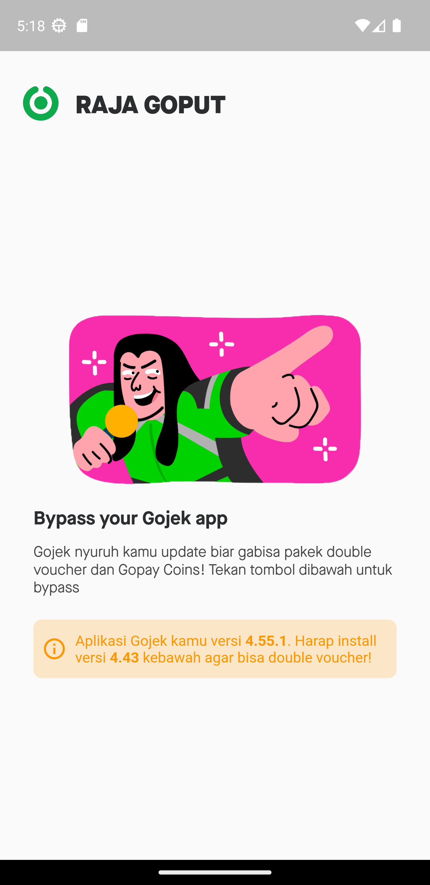
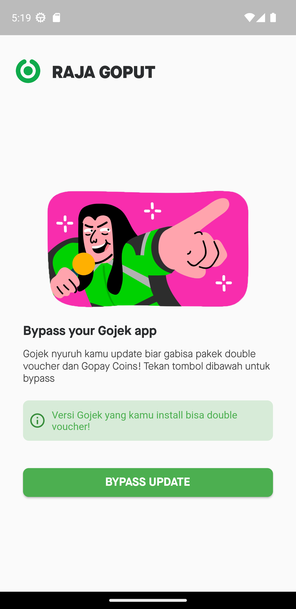

# Home Activity Launcher Shortcut

Home Activity Launcher Shortcut untuk Gojek (No Root Required!)

## About

Gojek mulai menghentikan penggunanya menggunakan versi aplikasi 4.54.2 kebawah. Pengguna Jasderdor tentu ketar-ketir dengan kebijakan baru inih xixi

Aplikasi ini ngebypass pop-up nya cuy, jadi versi aplikasi lawas bisa jalan lagi seperti biasa!

Dibuat menggunakan Flutter.

(last updated 02/11/2022)

## How-to

1. Install APK dari Releases Section
2. Enjoy

or

You can build yourself :)

## Screenshots

 

## Contributors

