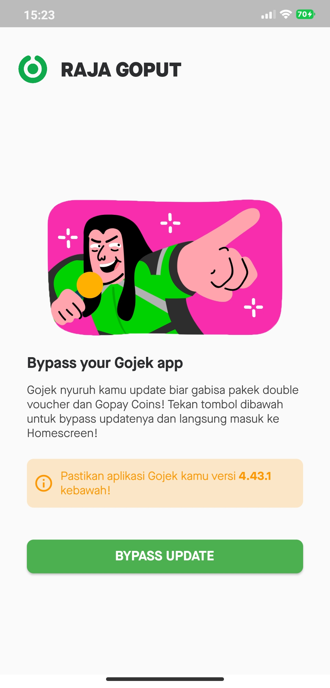

# Raja Goput

Bypass Gojek Update Pop-Up in One-Click (No Root Required!)

## About

Gojek mulai menghentikan penggunanya menggunakan versi aplikasi 4.54.2 kebawah. Pengguna Jasderdor tentu ketar-ketir dengan kebijakan baru inih xixi

Aplikasi ngebypass pop-up nya cuy, jadi versi aplikasi lawas bisa jalan lagi!

Ditulis menggunakan Flutter.

(02/11/2022)

## How-to

You can build yourself :)

## Screenshots

 

## Contributors

